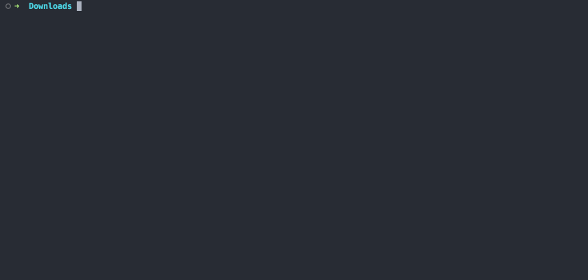

# read-estimate

read-estimate is a CLI tool to find out how long it will take to read books or documents within a directory.



## Installation

Run

```
npm install -g read-estimate
```

Make sure you have <a href="https://nodejs.org/" target="_blank">Node</a> installed


## Usage

```
read-estimate [options] [path]
```

If no path is provided, it will process documents in the current directory.

### Options

- `--wpm <number>`: Set the words per minute reading speed (default: 200)
- `--timesort`: Sort books by reading time duration in descending order
- `--help`: Show help information

### Examples

Process all supported documents in the current directory:
```
read-estimate
```

Process a single document:
```
read-estimate mybook.pdf
```

Process documents in a specific directory with custom reading speed:
```
read-estimate --wpm 250 /path/to/documents
```

Process files and sort by reading time duration:
```
read-estimate --timesort /path/to/documents
```

## Supported file formats

- PDF (.pdf)
- EPUB (.epub)
- Microsoft Word (.docx)
- Plain Text (.txt)
- Markdown (.md)
- Rich Text Format (.rtf)
- OpenDocument Text (.odt)
- HTML (.html)


## License

This project is licensed under the MIT License.